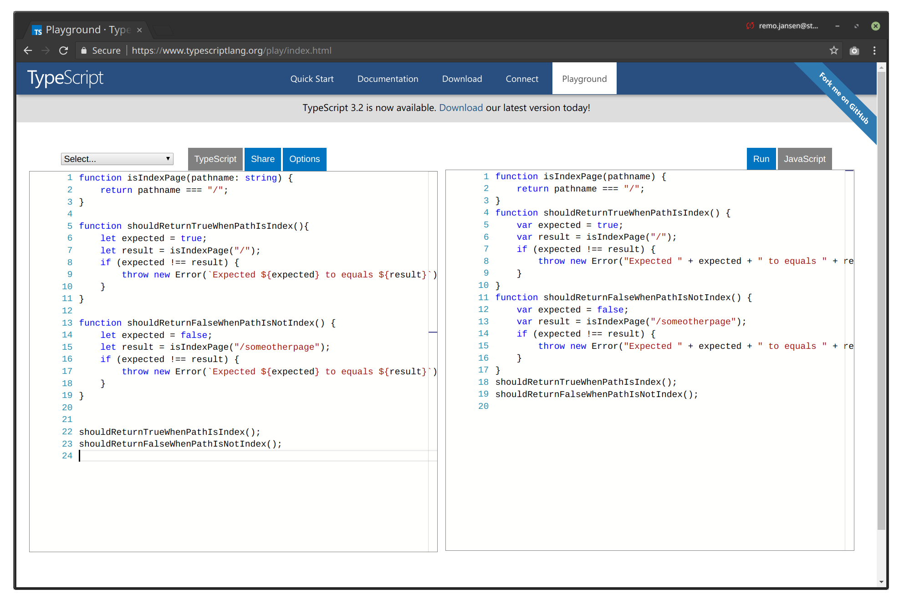
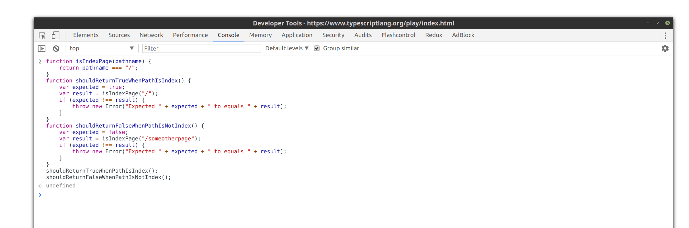

# Hands-On-Functional-Programming-with-Typescript

Hands-On Functional Programming with Typescript, published by Packt

## Notes

The code examples use a `namespace` for each demo to prevent conflicts between variables declared in multiple examples.
In real-world TypeScript applications using `namespaces` (AKA internal modules) is discouraged and ES6 modules should be the preferred option instead.

## How to run the examples?

In order to be able to run the examples you need to first install all the required dependencies using the following command:

```sh
npm install
```

You will also need to install TypeScript and ts-node as global dependencies:

```
npm install -g typescript ts-node
```

You can then run then run an example using the ts-node command:

```
ts-node chapters/chapter_01_fp_fundamentals/01_pure_vs_inpure.ts 
```

The `01_pure_vs_inpure.ts` example will not display anything in the terminal.
This is normal because now functions are invoked in the examples.
Also the examples uses `window.location` so we would need to invoke
the function in a web browser not in Node.js.

The best option for this case is to copy the example in the [TypeScript Playground](https://www.typescriptlang.org/play/index.html).

We can copy the code in the playground (left) to get the resulting JavaScript output (right)



It is important to enable all the TypeScript strict features in the playgrounf:


We can then execute the resulting JavaScript code in the console in the developer tools of our web browser:



The examples are designed so you can experiment with them and learn by yourself. In the case of the examples in the `01_pure_vs_inpure.ts` file, you will have to add some additional code to see the effects. You can invoke one function at a time to get a better idea of what is going on.

Other examples, such as the ones in the `02_side_effects.ts` files, can be executed using `ts-node` without the need of a browser:

```
ts-node chapters/chapter_01_fp_fundamentals/02_side_effects.ts
```

Some examples will fail at compilation time or runtime time.

## Code examples

- [Chapter 01: Functional programming fundamentals](./chapters/chapter_01_fp_fundamentals/)
- [Chapter 02: Mastering functions](./chapters/chapter_02_mastering_functions/)
- [Chapter 03: Mastering async programming](./chapters/chapter_03_mastering_async_programming/)
- [Chapter 04: The runtime: the event loop_and the this operator](./chapters/chapter_04_the_event_loop_and_this_operator/)
- [Chapter 05: The runtime: closures and prototypes](./chapters/chapter_05_closures_and_prototypes/)
- [Chapter 06: Functional programming techniques](./chapters/chapter_06_fp_techniques/)
- [Chapter 07: Category theory](./chapters/chapter_07_category_theory/)
- [Chapter 08: Optics, immutability and laziness](./chapters/chapter_08_optics_immutability_laziness/)
- [Chapter 09: Functional reactive programming](./chapters/chapter_09_functional_reactive_programming/)
- [Chapter 10: Real world functonal programming](./chapters/chapter_10_real_world_fp/)
